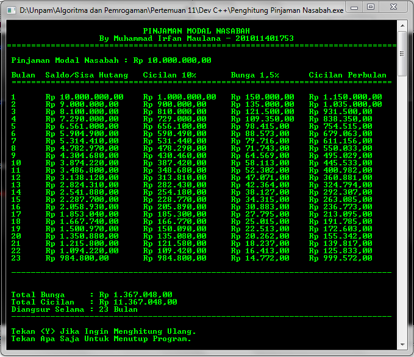
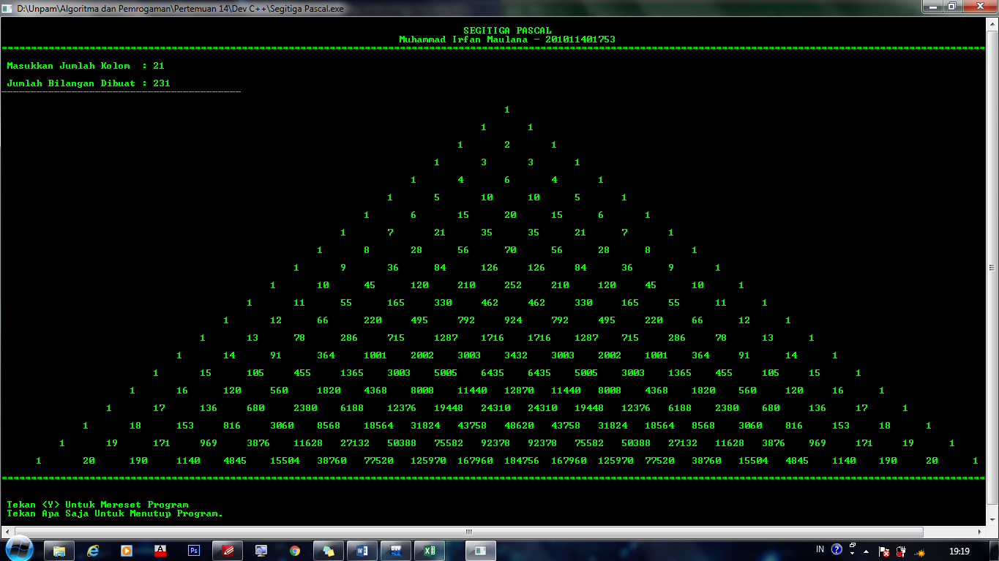

# 🚀 cpp-initial-collection


Welcome to **cpp-initial-collection** — a curated and well-organized repository featuring **200+ essential C++ mini programs** designed to build and demonstrate your foundational programming skills.

Whether you're a **beginner** aiming to master the basics or an **intermediate** coder sharpening your knowledge, this collection offers structured and progressive C++ learning by topic.


## 📁 Repository Structure Overview

Explore various categories of core C++ concepts — from basic input/output to complex algorithms — all neatly grouped for easy navigation:

| Folder Name                            | Description                                                                 |
|----------------------------------------|-----------------------------------------------------------------------------|
| **Array**                              | Basic array concepts: declaration, initialization, manipulation            |
| **Array One Dimension**                | One-dimensional arrays: traversal, search, sort                            |
| **Do While and Nested Loop**           | Iteration using `do-while` and multiple levels of nested loops             |
| **Files Operation**                    | Reading from and writing to external files                                 |
| **For and While**                      | Repetitive logic using `for` and `while` loops                             |
| **IF Statement**                       | Control flow using basic `if` and `if-else` statements                     |
| **Input and Output**                   | Input/output using `cin`, `cout`, and formatting                          |
| **Library Function**                   | Use of standard C++ library functions for strings, math, etc.             |
| **Linked List**                        | Singly linked list operations: insert, delete, traverse                    |
| **Math Operation**                     | Arithmetic, factorial, combinations, and Pascal triangle                   |
| **Nested IF and Switch**               | Decision-making using nested `if` and `switch-case` structures            |
| **Number**                             | Numerical logic: even/odd, prime, palindrome checks                        |
| **Operator and Expression**            | Usage of arithmetic, relational, logical, and compound operators           |
| **Pointer**                            | Memory handling with pointers, pointer arithmetic, and indirection        |
| **Procedure and Function**             | Custom procedures/functions, recursion, parameter passing                 |
| **Searching**                          | Linear and binary search implementations                                  |
| **Searching Advanced**                 | Indexed search, optimized binary search, descending/ascending order       |
| **Sorting**                            | Sorting algorithms: bubble, insertion, selection, shell                   |
| **Study Case**                         | Simple case studies integrating multiple concepts                         |
| **Stack**                              | Stack implementation using arrays or pointers                             |
| **String**                             | String manipulation: reverse, count, compare                              |
| **Structure**                          | Custom `struct` usage: grouping multiple data types                       |
| **Variabel and Constanta Data Types**  | Declaration and usage of `const`, variables, and various data types       |


## 🖼️ Showcase Examples
### 📊 Loan Simulation Calculator
Simulates monthly loan repayments using user input and loops.  
[📂 View Source Code](./code/do-while-and-nested-loop/Penghitung_Pinjaman_Nasabah.cpp)



---

### 🔺 Pascal Triangle Generator
Generates Pascal’s Triangle using nested loops and combinatorial logic.  
[📂 View Source Code](./code/math-operation/Segitiga_Pascal.cpp)




## ✨ Highlights

- 🧹 **Clean, Modular Code** — Easy to read and understand
- 🎓 **Educational Focus** — Ideal for learning or teaching core C++ concepts
- ⚙️ **Ready-to-Run** — Executable `.exe` files included (compiled with DevC++)
- 🗂️ **Structured Layout** — Each topic is isolated into folders with meaningful file names


## 🛠️ How to Run

You can either:

### 🏃 Run Precompiled Executables:
> Navigate to `.exe` files included in the repo and run them directly on Windows.  
These were built using **DevC++** for compatibility and ease of use.

### 🔧 Compile from Source:
Use your preferred C++ compiler (e.g. `g++`, MSVC, clang):

```bash
g++ Path/To/File.cpp -o Output.exe
./Output.exe
````

Or run in your favorite IDE (Visual Studio, Code::Blocks, VS Code, etc).


## 📜 License

This project is licensed under the **MIT License**.
See the [LICENSE](./LICENSE) file for full terms.